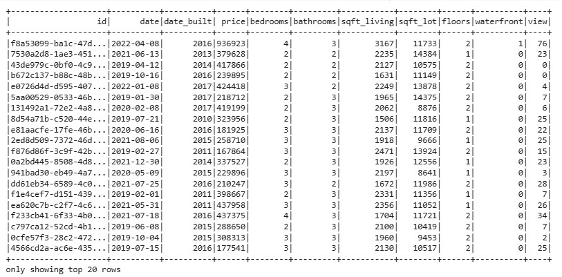
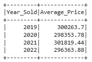
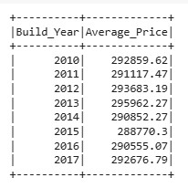
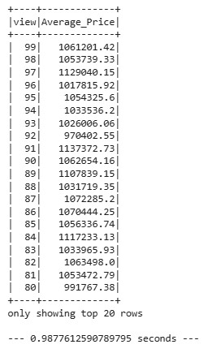
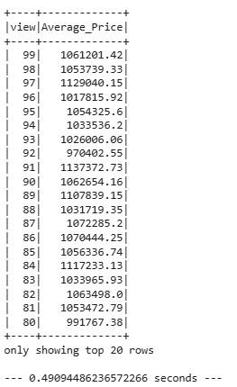
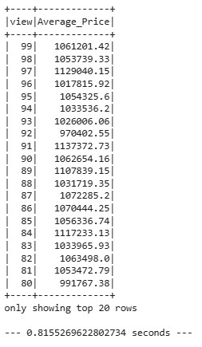

# home_sales
SparkSQl - Data Analytics Course Module 22

# Task
Using SparkSQL, I'll determine key metrics about home sales data. 

# Methodology
I'll use Spark to create temporary views, partition the data, cache and uncache a temporary table, and verify that the table has been uncached.

## Results

Home Sales DataFrame

- What is the average price for a four-bedroom house sold for each year? Round off your answer to two decimal
 places.

- What is the average price of a home for each year the home was built, that has three bedrooms and three
 bathrooms? Round off your answer to two decimal places.

 - What is the average price of a home for each year the home was built, that has three bedrooms, three
 bathrooms, two floors, and is greater than or equal to 2,000 square feet? Round off your answer to two
 decimal places.

 - What is the average price of a home per "view" rating having an average home price greater than or equal to
 $350,000? Determine the run time for this query, and round off your answer to two decimal places.

Using cached data

Using a parquet DataFrame

